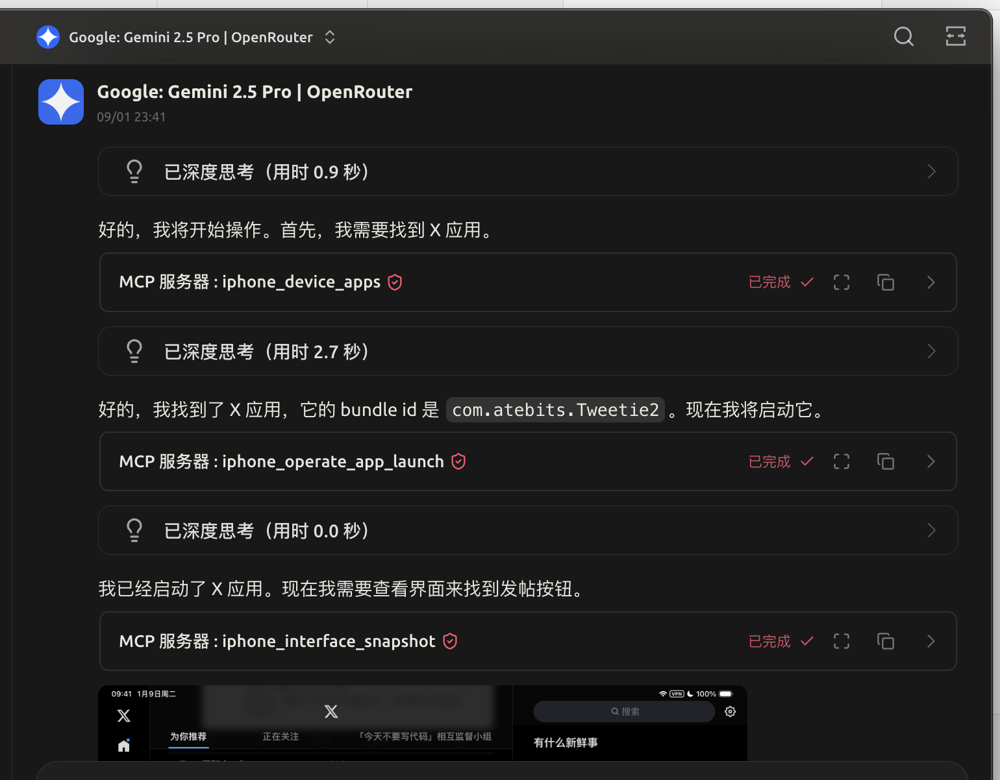

# iPhone MCP Server

A Model Context Protocol (MCP) server for automating iPhone tasks with Appium. Supports app control, UI interactions, and screenshot capture via streamable HTTP.

We recommend [Cherry Studio](https://github.com/CherryHQ/cherry-studio) as an MCP client for iPhone automation.

## Features

- Retrieve device info and list installed apps
- Capture screenshots (JPEG, around 500KB)
- List UI elements and perform touch operations
- Launch or switch apps using bundle IDs
- Optimized XML output to minimize token usage

## Installation

### Prerequisites

- Python 3.8 or later
- Node.js and npm
- iPhone with UDID
- Xcode

### Steps

1. Clone the repo: `git clone https://github.com/Lakr233/iphone-mcp.git && cd iphone-mcp`
2. Set up virtual environment: `python -m venv .venv && source .venv/bin/activate`
3. Install dependencies: `pip install -r requirements.txt`
4. Install Appium: `npm install -g appium && appium driver install xcuitest`
5. Set up WebDriver Agent: Follow the [WebDriver Agent Guide](https://appium.github.io/appium-xcuitest-driver/latest/guides/run-prebuilt-wda/)
6. Configure: Edit `start.sh` with your `DEVICE_UDID`

## Usage

Run `./start.sh` to start Appium and the MCP server. Access it at `http://127.0.0.1:8765/mcp` with default settings.

## Tools

- `iphone_device_info`: Get device details
- `iphone_device_apps`: List installed apps
- `iphone_interface_snapshot`: Capture screenshot and XML
- `iphone_interface_elements`: List UI elements
- `iphone_operate_click`: Perform tap
- `iphone_operate_swipe`: Perform swipe
- `iphone_operate_text_input`: Input text
- `iphone_operate_app_launch`: Launch app
- `iphone_operate_get_current_bundle_id`: Get current bundle ID

## Configuration

Set environment variables in `start.sh` (defaults in `src/utils.py`):

- `DEVICE_UDID` (required)
- `APPIUM_HOST/PORT`
- `SERVER_HOST/PORT/PATH`
- `LOG_LEVEL`

## Development

- Run tests: `pytest`
- Code style: Python 3.8+ with type hints

## Contributing

Fork the repo, create a branch, and submit a pull request. Report bugs or suggest features via issues.

## License

MIT
